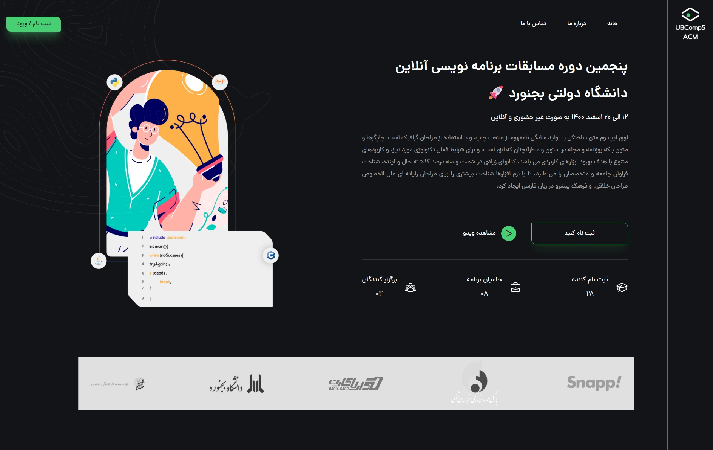
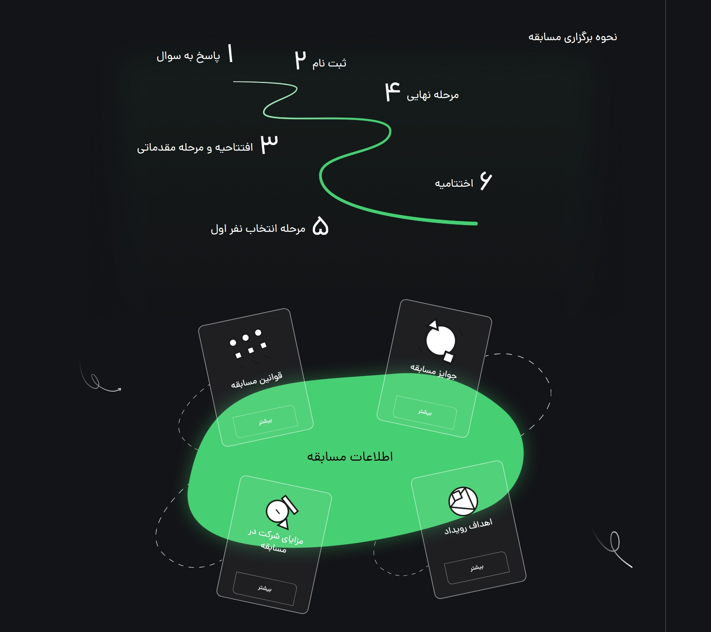
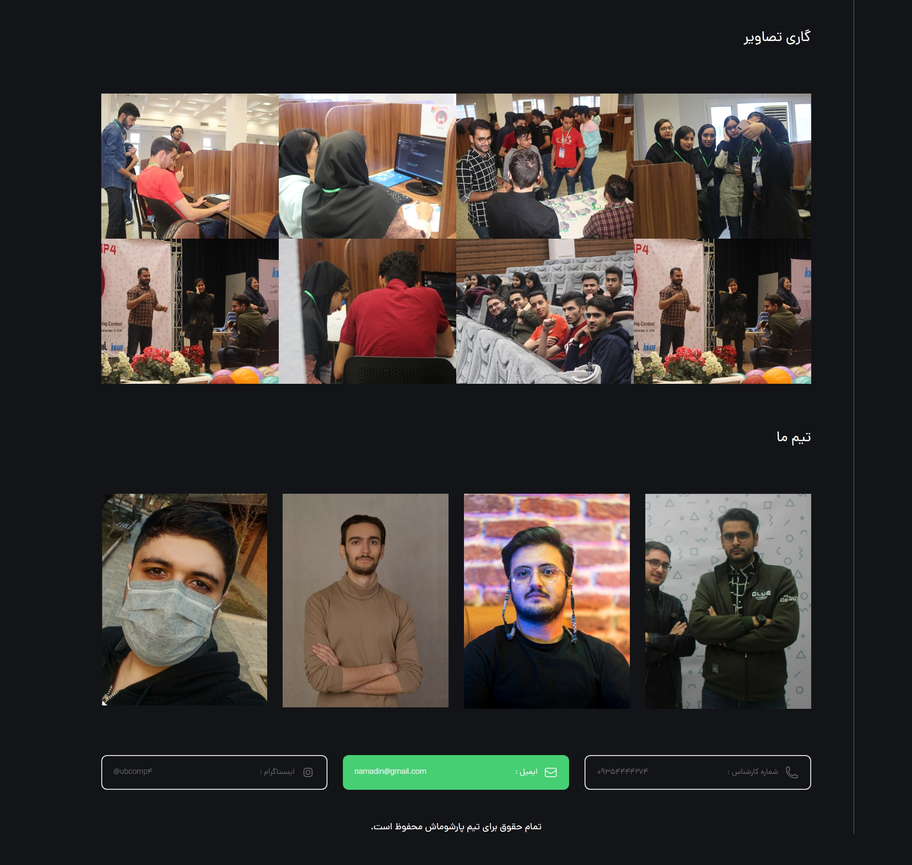

### 🧑‍💻 CodeBattle Landing Page

این پروژه یک لندینگ حرفه‌ای و کاملاً واکنش‌گرا برای پنجمین دوره مسابقات برنامه‌نویسی آنلاین دانشگاه دولتی بجنورد است که توسط انجمن علمی ACM برگزار شد

___

### 📚 معرفی

در این لندینگ، اطلاعات کامل مسابقه، فرم ثبت‌نام، گالری تصاویر، قوانین مسابقه و معرفی برگزارکنندگان به‌صورت منظم و جذاب ارائه شده است.
این پروژه مهارت‌های من در زمینه توسعه فرانت‌اند، طراحی رابط کاربری مدرن و کاربرپسند، و پیاده‌سازی صفحات وب واکنش‌گرا را به خوبی نشان می‌دهد.
تمرکز اصلی در این پروژه بر ایجاد تجربه کاربری ساده، زیبا و در دسترس برای شرکت‌کنندگان مسابقه بوده است، به طوری که هم در دسکتاپ و هم در موبایل عملکردی بی‌نقص داشته باشد.
___

### 🖥️ پیش‌نمایش

___

### 🔧 تکنولوژی‌های استفاده شده
- HTML5
- TailwindCss
- JavaScript
- طراحی واکنش‌گرا (Responsive Design)
- UI Design

___

### ✨ ویژگی‌ها

- 📄 **بخش معرفی** معرفی مسابقه و درباره برگزارکنندگان
- 🧠 **ثبت نام** فرم ثبت‌ نام شرکت‌کنندگان
- 🖼️ **اطلاعات مسابقه** – جزئیات و قوانین مسابقه
- 📩 **درباره ما** – معرفی برگزارکنندگان و انجمن علمی
- 💡 **گالری تصاویر** – نمایش پروژه‌ها و تصاویر مرتبط
- 📱 **کاملاً واکنش‌گرا** – سازگار با موبایل، تبلت و دسکتاپ  
- ✅ **و....** – امکانات تکمیلی و بهبود تجربه کاربری

___

### 🎯 آماده همکاری هستم!

اگر پروژه‌ای در ذهن دارید—چه طراحی سایت شخصی، فروشگاهی یا شرکتی—من اینجا هستم تا به بهترین شکل به شما خدمات ارائه بدم

📩 از طریق آیدی تلگرامی یا ایمیل، به راحتی می‌تونید با من در ارتباط باشید.
___

👤 توسعه‌ دهنده :
محمدرضا جعفری

ساخته شده با ❤️ 

___

### 🧑‍💻 CodeBattle Landing Page

This project is a professional and fully responsive landing page created for the 5th Online Programming Contest of Bojnord University, organized by the ACM Student Chapter.
---

### 📚 Overview

This landing page presents complete information about the competition — including the registration form, image gallery, contest rules, and organizer introductions — in a clean and engaging layout.
The project showcases my skills in front-end development, modern and user-friendly UI design, and the implementation of fully responsive web pages.
The main focus was to create a smooth, visually appealing, and accessible user experience for participants, ensuring flawless performance across both desktop and mobile devices.

___

### 🛠️ Built With

- HTML5
- TailwindCss
- JavaScript
- Responsive Design
- UI Design

___

### ✨ Key Features

- 📄 **Introduction Section** Overview of the contest and information about the organizers
- 🧠 **Registration** Participant registration form
- 💡 **Contest Info** – Details and rules of the competition
- 📩 **About Us** – Introduction to the organizing team and ACM Student Chapter
- 🖼️ **Image Gallery** – Display of related projects and event photos
- 📱 **Fully Responsive** –  Optimized for mobile, tablet, and desktop devices 
- ✅ **And More…** –  Additional features and enhancements for a better user experience 

___

### 🎯 Ready to Collaborate!

If you have a project in mind—whether it’s a personal, e-commerce, or corporate website—I’m here to provide you with the best possible service.

📩 Feel free to reach out to me easily via my Telegram ID or email.
___
👤 Author :
 Mohammadreza Jafari

Made with ❤️
